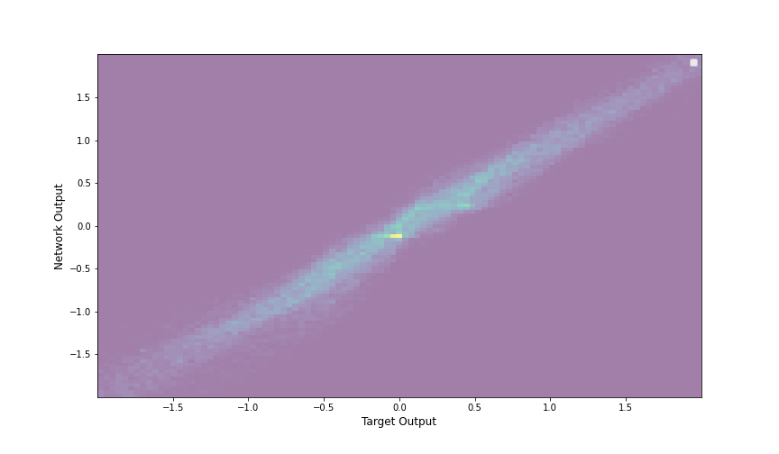

# Using Deep Neural Networks to Reconstruct Intermediate Particles

## Skills
ML: Deep Neural Network
Python: PyTorch, pandas, numpy
Scalable deployment: Docker, AWS

## Executive Summary
Processing research-level data can be time intensive and often requires selecting a handful of interesting metrics.
Splitting the data into different buckets based on the desired metrics can result in decreased statistical sensitivity, as well as increased analysis time while researchers explore the sensitivity of various metrics.
**Deep neural networks** (DNNs) allow us to instead pass the high-dimensional data directly to a model and retrieve accurate predictions.
One area where DNNs can significantly improve analyses is in intermediate particle reconstruction.
When certain particles decay, some of the information can be lost due to detector configurations and inefficiencies.
DNNs can harness the concept of regression to learn how to properly predict these intermediate particles based solely on the available detector information.
I simulated 100,000 particle decays, including the loss of momentum information due to particles known as neutrinos.
I coded a DNN in PyTorch to take in this lossy final-state information, as well as the "truth-level" information of the particles I simulated before decay.
The DNN was able to accurately reconstruct intermediate particle information with a coefficient of determination (R^2) of at last 0.9 for each dimension.
The model was deployed in a **Docker** container using the EC2 service on **AWS**.

## Business Problem
How can scalable deep learning models accelerate scientific discovery and reduce computational costs in high-energy physics research?

## Methodology
1. Developed a **DNN** using **PyTorch**
    - Simulated particles and their decay products, including loss of information
    - Split data into training and validation batches
1. Train and validate the model
    - Used the training set to training the model to preact the intermediate particles based only on the decay products
    - Used the validation set to ensure the model can reliably predict data is has not seen before
1. Deployed the model on AWS

## Results & Recommendations
We observe reliable reconstruction of intermediate particles, allowing for more accurate scientific research.
The R^9 of 0.9 or greater on a dedicated validation set ensures the model is working robust, and we can trust the predictions it produces.
I recommend analyzers begin to adopt methods such as these to improve the efficiency of scientific research.
By offloading complex and mundane tasks like optimizing metric selection to ML models, we can provide the analyzers with more time to think about the "big picture".
This optimization will help boost productivity and reduce the amount of time between research publications.

A plot of the true x-axis momentum vs the reconstructed value. The thin line indicates the DNN is accurately reproducing the desired values.

## Next Steps:
1. Expand model to incorporate more information
1. Implement in a sophisticated "simulation based inference" analysis instead of a traditional histogram approach
1. Explore scalability of model on cloud platform

   
